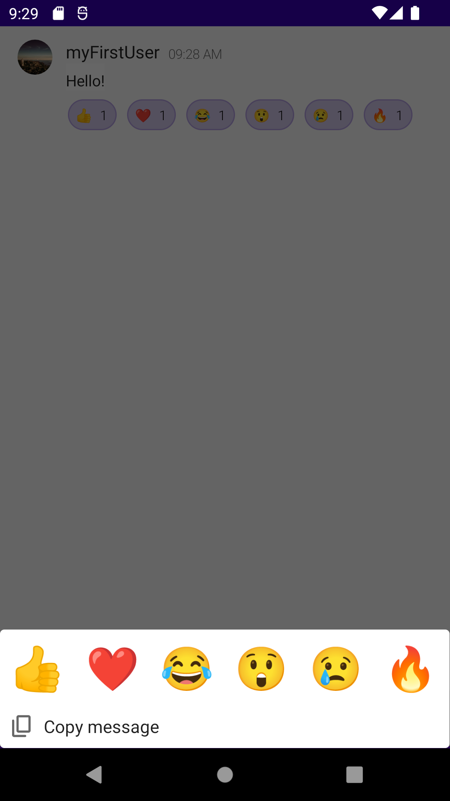

# Getting Started with Message Reactions

`getting-started-with-reactions` is a basic 1:1 chat application that features a message input field and a list of messages that pile up on the screen as you send them. In addition to this basic functionality, the app contains 6 built-in message reactions that you can add to the messages by long-tapping on them and selecting emojis from the bottom drawer that slides up from the bottom edge of the screen when triggered.

 

## Prerequisites

This application uses [PubNub Kotlin SDK](https://github.com/pubnub/kotlin) (>= 7.0.0) for chat components and [Jetpack Compose](https://developer.android.com/jetpack/compose) as the UI Toolkit.

To use the app, you need:

* [Android Studio](https://developer.android.com/studio/preview) (>= Bumblebee 2021.1.1)
* PubNub account on [Admin Portal](https://dashboard.pubnub.com/)

## Usage

Read the [Getting Started](https://www.pubnub.com/docs/chat/components/android/get-started-android) guide to learn how to use the app and better understand the logic behind it.

## Features

The `getting-started-with-reactions` app showcases these PubNub Chat Components for Android:

* [MessageInput](https://www.pubnub.com/docs/chat/components/android/ui-components-android#messageinput)
* [MessageList](https://www.pubnub.com/docs/chat/components/android/ui-components-android#messagelist)
* [MessageReactions](https://www.pubnub.com/docs/chat/components/android/message-reactions-android)
