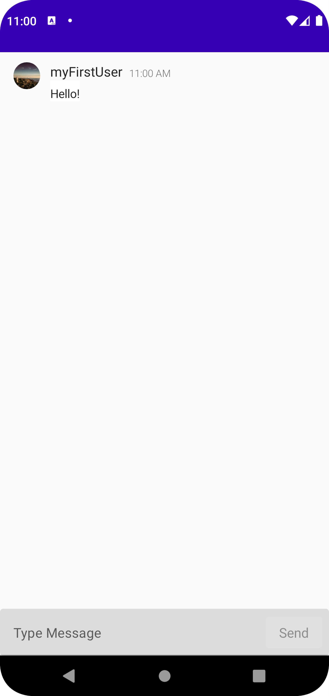

# Getting Started Application

`getting-started` is a basic 1:1 chat application that features a message input field and a list of
messages that pile up on the screen as you send them.

 

## Prerequisites

This application uses [PubNub Kotlin SDK](https://github.com/pubnub/kotlin) (>= 7.3.2) for chat
components and [Jetpack Compose](https://developer.android.com/jetpack/compose) as the UI Toolkit.

To use the app, you need:

* [Android Studio](https://developer.android.com/studio) (>= Dolphin 2021.3.1)
* PubNub account on [Admin Portal](https://dashboard.pubnub.com/)

## Usage

Read the [Getting Started](https://www.pubnub.com/docs/chat/components/android)
guide to learn how to use the app and better understand the logic behind it.

## Features

The `getting-started` app showcases these PubNub Chat Components for Android:

* [MessageInput](https://www.pubnub.com/docs/chat/components/android/ui-components#messageinput)
* [MessageList](https://www.pubnub.com/docs/chat/components/android/ui-components#messagelist)
