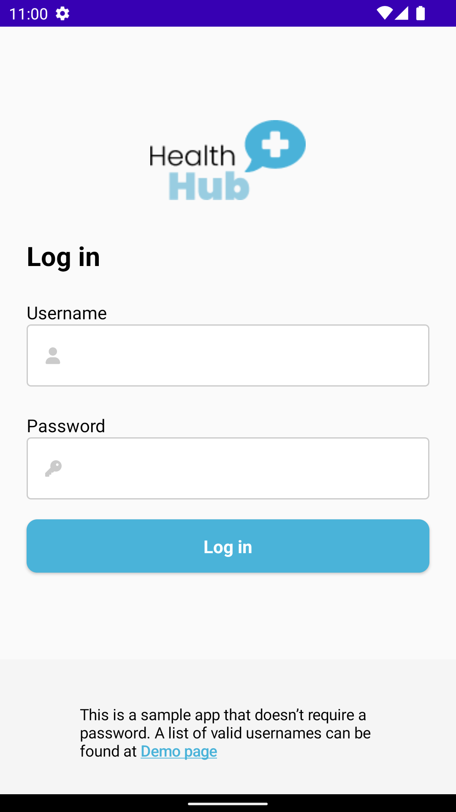

# Telehealth Example

`telehealth-example` is a basic chat application that features communication between a doctor and a
patient.

 

## Prerequisites

This application uses [PubNub Kotlin SDK](https://github.com/pubnub/kotlin) (>= 7.0.0) for chat
components and [Jetpack Compose](https://developer.android.com/jetpack/compose) as the UI Toolkit.

To use the app, you need:

* [Android Studio](https://developer.android.com/studio/preview) (>= Bumblebee 2021.1.1)
* PubNub account on [Admin Portal](https://dashboard.pubnub.com/)

## Features

The `telehealth-example` app showcases these components and features:

* [MessageInput](https://www.pubnub.com/docs/chat/community-supported/android/ui-components#messageinput)
* [MessageList](https://www.pubnub.com/docs/chat/community-supported/android/ui-components#messagelist)
* [ChannelList](https://www.pubnub.com/docs/chat/community-supported/android/ui-components#channellist)
* [Message Reactions](https://www.pubnub.com/docs/chat/community-supported/android/message-reactions)
* [Message Menu](https://www.pubnub.com/docs/chat/community-supported/android/message-menu) (with the copying
  option)

## Usage

Read
the [tutorial](https://www.pubnub.com/tutorials/cross-platform-chat-application-telehealth-android/)
to learn how to use the app and better understand the logic behind it.

## Usernames

You can log into the app either as a doctor or as one of the patients. Type in one of the available
usernames and tap Log in. You don't need a password to log in.

### Patients

* lukeyoung
* saraflores

### Doctors

* suejones
