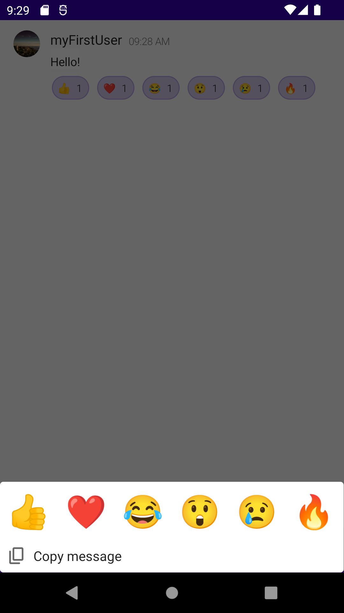

# Telehealth Example

`getting-started-with-reactions` is a basic 1:1 chat application that features a message input field
and a list of messages that pile up on the screen as you send them. In addition to this basic
functionality, the app contains 6 built-in message reactions that you can add to the messages by
long-tapping on a message and selecting emojis from the bottom menu that slides up from the bottom
edge of the screen when triggered.

 

## Prerequisites

This application uses [PubNub Kotlin SDK](https://github.com/pubnub/kotlin) (>= 7.0.0) for chat
components and [Jetpack Compose](https://developer.android.com/jetpack/compose) as the UI Toolkit.

To use the app, you need:

* [Android Studio](https://developer.android.com/studio/preview) (>= Bumblebee 2021.1.1)
* PubNub account on [Admin Portal](https://dashboard.pubnub.com/)

## Usage

Read the [Message Reactions](https://www.pubnub.com/docs/chat/components/android/message-reactions-android#enable-reactions)
document to learn how to use the app and better understand the logic behind it.

## Features

The `telehealth-example` app showcases these components and features:

* [MessageInput](https://www.pubnub.com/docs/chat/components/android/ui-components-android#messageinput)
* [MessageList](https://www.pubnub.com/docs/chat/components/android/ui-components-android#messagelist)
* [ChannelList](https://www.pubnub.com/docs/chat/components/android/ui-components-android#channellist)
* [MessageReactions](https://www.pubnub.com/docs/chat/components/android/message-reactions-android)
* Message Menu (with the copying option)

# Telehealth Application

`telehealth-example` is a basic chat application that features communication between doctor and patient.

 

## Prerequisites

This application uses [PubNub Swift SDK](https://github.com/pubnub/swift) for chat components and [UIKit](https://developer.apple.com/documentation/uikit) as the UI Toolkit.

To use the app, you need:

* [Xcode](https://developer.apple.com/xcode/) (>= Xcode 13)
* PubNub account on [Admin Portal](https://dashboard.pubnub.com/).

## Usage

Read the [Getting Started](https://www.pubnub.com/docs/chat/components/ios/get-started-ios) guide to learn how to use the app and better understand the logic behind it.

## Features

The `telehealth-example` app showcases these PubNub Chat Components for iOS:

* [MessageInput](https://www.pubnub.com/docs/chat/components/ios/ui-components-ios#messageinput)
* [MessageList](https://www.pubnub.com/docs/chat/components/ios/ui-components-ios#messagelist)

## Usernames

### Patients

* lukeyoung
* saraflores

### Doctors

* suejones

## Pasword is not needed